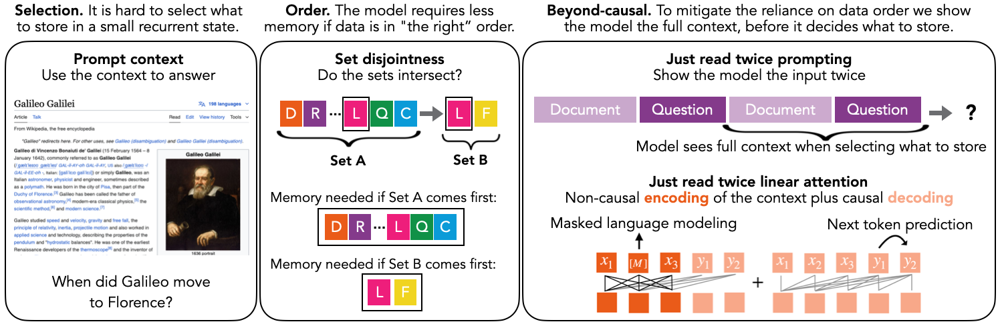

<div align="center" >
     

**Just read twice: closing the recall gap for recurrent language models.**

[](https://arxiv.org/abs/2402.18668)
[](https://img.shields.io/github/license/HazyResearch/meerkat)

[](https://huggingface.co/collections/hazyresearch/jrt-666296fb18c35a31a3c364b9) 
[](https://huggingface.co/collections/hazyresearch/jrt-666296fb18c35a31a3c364b9)
<!-- [](https://github.com/pre-commit/pre-commit) -->
<!-- [](https://huggingface.co/models) -->

</div>

## Overview

This is part of a line of research in understanding the key quality-efficiency tradeoffs in how subquadratic architectures perform in-context learning. A key axis that differentiates LM architectures is their *recall* abilities, i.e., being able to ground next token predictions in information provided in-context beyond merely information the model memorized during training.

- [Zoology](https://arxiv.org/abs/2312.04927) explores the tradeoffs around **input-dependent sequence mixing** and the **model dimension** (efficiency) needed to perform recall. 
- [Based](https://arxiv.org/abs/2402.18668) explores the tradeoffs around varying the **recurrent state size** for *causal* linear attention models. Increasing state size increases the  GPU memory requirements during inference, but boosts recall quality. 
- [Just read twice]() explores going **beyond causal language modeling** to help recurrent models better decide what to store in the fixed-memory state.

Attention drastically outperforms prior subquadratic LMs at recall. We use our understanding of these tradeoffs to design new methods. The Based architecture extended the Pareto frontier of the throughput-recall tradeoff space beyond its predecessor subquadratic models. This work presents two methods, a new prompting strategy JRT-Prompt and a new architecture JRT-RNN (included in the figure below), to further close the recall gap to attention!

<div align="center" >
     
</div>


## Table of contents
- [Installation](#Installation)
- [Just read twice prompting](#Just-read-twice-prompting)
- [Just read twice recurrent model evaluation](#Just-read-twice-recurrent-model-evaluation)
- [Just read twice recurrent model training](#Just-read-twice-recurrent-model-training)
- [Synthetics](#Synthetics)
- [Benchmarking](#Benchmarking)
- [Citations and acknowledgements](#Citations-and-acknowledgements)


## Installation

We recommend using a clean environment. 

```bash
# clone the repository
git clone git@github.com:HazyResearch/just-read-twice.git
cd just-read-twice

# install torch
pip install torch==2.1.2 torchvision==0.16.2 torchaudio==2.1.2 --index-url https://download.pytorch.org/whl/cu118 

# install package
pip install -e .
```

## Just read twice prompting

The following instructions are for reproducing the JRT-Prompting results.

To get setup:
```bash
cd lm-eval-harness
pip install -e .
```

To reproduce Table 1 in our ArXiv, you can use the following scripts. In the scripts, enter an ```output_directory``` name.
```bash
bash prompt_scripts/run_jrt_prompt_hf.sh
bash prompt_scripts/run_jrt_prompt_hazy.sh
```

To view the results and save a consolidated dataframe with all the model predictions, enter your ```output_directory``` name and ```prefix_path``` in this file and run:
```
python prompt_scripts/collect_results.py
```

## Just read twice recurrent model evaluation

We release the following JRT-RNN checkpoints. These models are trained on the same tokens in the same data order:

-  360M parameters, 30Bn Pile tokens: ```hazyresearch/JRT-360M-30B```, ```hazyresearch/based-360M-30B```, ```hazyresearch/mamba-360M-30B```, ```hazyresearch/attn-360M-30B``` 

- 1.3B parameters, 50Bn Pile tokens: ```hazyresearch/JRT-1B-50B```, ```hazyresearch/based-1b-50b```, ```hazyresearch/mamba-1b-50b```, ```hazyresearch/attn-1b-50bn``` 

To get setup:
```bash
cd lm-eval-harness
pip install -e .
```

To reproduce Table 2 in our ArXiv, you can use the following script. In the script, enter an ```output_directory``` name.
```
bash architecture_scripts/run_jrt_rnn.sh
```

To view the results and save a consolidated dataframe with all the model predictions, enter your ```output_directory``` name and ```prefix_path``` in this file and run:
```
python architecture_scripts/collect_results.py
```

To explore generation independently of these evaluations, we include the following code snippets:
```python  
import torch
from transformers import AutoTokenizer
from train.src.models.gpt import GPTLMHeadModel

# JRT and Based
tokenizer = AutoTokenizer.from_pretrained("gpt2")
model = GPTLMHeadModel.from_pretrained_hf("hazyresearch/JRT-1B-50B")
model = GPTLMHeadModel.from_pretrained_hf("hazyresearch/based-1b-50b")

# attention 
from based.models.transformer.gpt import GPTLMHeadModel
tokenizer = AutoTokenizer.from_pretrained("gpt2")
model = GPTLMHeadModel.from_pretrained_hf("hazyresearch/attn-1b-50bn").to("cuda")

# Mamba. Ensure you have run ```pip install mamba_ssm```.
from based.models.mamba import MambaLMHeadModel
tokenizer = AutoTokenizer.from_pretrained("gpt2")
model = MambaLMHeadModel.from_pretrained_hf("hazyresearch/mamba-1b-50b").to("cuda")
```

## Just read twice recurrent model training

To get setup:
```bash
# install train extra dependencies
pip install -e .[train]

# if it complains about pytorch-cuda mismatches,  comment out the line that checks, which is in the apex/setup.py file
git clone https://github.com/NVIDIA/apex
cd apex
pip install -v --disable-pip-version-check --no-cache-dir --no-build-isolation --config-settings "--build-option=--cpp_ext" --config-settings "--build-option=--cuda_ext" ./

# CUDA kernel installs
git clone https://github.com/Dao-AILab/flash-attention.git
cd flash-attention/
cd csrc/layer_norm && pip install -e . && cd ..
cd csrc/rotary && pip install -e . && cd ..
cd csrc/fused_dense_lib && pip install -e . && cd ..
```

Train a new model as follows, where you can change ```trainer.devices``` depending on the number of GPUs you have in your node:
```bash
cd train/
python run.py experiment=reference/jrt-1b-50b trainer.devices=8
```

Here, ```reference/jrt-1b-50b``` is an **experiment** configuration file for data, architecture, and optimization located at ```train/configs/experiment/reference/```. Modify it to your needs.

To swap the training dataset, (1) create a new config like ```train/config/datamodules/wikitext103.yaml``` for your dataset by swapping the dataset names etc., and (2) replace the ```wikitext103``` (for ```override datamodule```) in the **experiment** config to your filename.

Be sure to update the checkpointing directory [in the config](https://github.com/HazyResearch/based/blob/3fb009b8216b41d14ea3a2ab9552a5c609ef0bf4/train/configs/experiment/example/based-360m.yaml#L39) prior to launching training.

## Synthetics 

The following instructions are for reproducing the set disjointness synthetic results. 

To get setup:
```bash
git submodule init
git submodule update
cd zoology/
pip install -e .
```

To produce figure 2 from our ArXiv, run the following. Note that the ```-p``` leads the sweep to parallelize across your GPUs. If you're debugging / don't want to parallelize, remove the flag. 
```bash
# causal based
python zoology/launch.py zoology/experiments/arxiv24_jrt_figure2/causal_sweep.py -p

# non-causal based
python zoology/launch.py zoology/experiments/arxiv24_jrt_figure2/non_causal_sweep.py -p
```

Plotting the figure. We use WandB to help pull down metrics and plot. To use this method, find the ```launch_id``` values on WandB for the sweeps you've launched and add them to the list of launch_id's in the following python file. Then run:
```bash
python zoology/experiments/arxiv24_jrt_figure2/plot.py
```

## Benchmarking

The following instructions are for comparing the JRT prefill speed to competitive baselines. The Based and JRT-RNN kernels will run on an NVidia H100 GPU since they exploit new features.

To get setup:
```bash
# general
git submodule init
git submodule update
cd ThunderKittens/
source env.src
```

***Profiling***  We include several benchmarks in our profiling file. If you want to exclude any, you can modify the imports and the ```methods``` dictionary in the python file, to filter to the subset you care about. You can then choose which kernels to install below:
```bash
# 1. based tk kernel setup
cd examples/jrt/H100/
python prefill_setup.py install

# 2. jrt-rnn tk kernel setup
cd examples/based/linear_attn_forward/H100/
python lin_attn_setup.py install

# 3. fast transformers kernel setup
cd examples/jrt/csrc/causal_dot_prod/
python setup.py install
cd ../../

# 4. flash linear attention kernel setup
pip install -U git+https://github.com/sustcsonglin/flash-linear-attention

# 5. flash attention kernel setup
pip install flash-attn
```

To profile and evaluate the correctness of these kernels against PyTorch:
```bash
cd ThunderKittens/examples/jrt/
python lin_attn_profile.py
```

***Demo*** We next provide a demo for running the speedy 💨 TK kernels in our end-to-end pretrained models! 
```bash
cd just-read-twice/
pip install -e .
cd benchmark/
python generate_based.py
python generate_jrt.py
```

## Citations and acknowledgements

Please reach out with feedback and questions! If you use or build on this work useful, please consider citing:
```
@article{arora2024just,
  title={Just read twice: closing the recall gap for recurrent language models},
  author={Arora, Simran and Timalsina, Aman and Singhal, Aaryan and Eyuboglu, Sabri and Zhao, Xinyi and Rao, Ashish and Rudra, Atri and Ré, Christopher},
  year={2024}
}
```

We also use or reference several prior works including: [FlashAttention](https://github.com/Dao-AILab/flash-attention) training code and kernels, [LM-Eval Harness](https://github.com/EleutherAI/lm-evaluation-harness) evaluation code, benchmark tasks ([NQ](https://ai.google.com/research/NaturalQuestions/), [SQUAD](https://rajpurkar.github.io/SQuAD-explorer/), [TriviaQA](https://huggingface.co/datasets/mandarjoshi/trivia_qa), etc.), [Flash linear attention kernels](https://github.com/sustcsonglin/flash-linear-attention/tree/main), [Conv1D kernel](https://github.com/state-spaces/mamba), [Fast transformers kernel](https://github.com/idiap/fast-transformers/blob/master/fast_transformers/attention/causal_linear_attention.py). We adapt the [Based repository](https://github.com/HazyResearch/based) and use the [Zoology synthetics infrastructure](https://github.com/HazyResearch/zoology) for this code release. **Please cite them if you use any of their resources.**

This work was made possible by compute from [Together AI](https://www.together.ai/). 
